# RemitLend System Architecture

RemitLend is a decentralized lending platform built on the Stellar network using Soroban smart contracts. It leverages remittance history to establish creditworthiness for migrant workers who lack traditional credit history.

## Table of Contents

- [Overview](#overview)
- [Architecture Principles](#architecture-principles)
- [System Components](#system-components)
- [Data Flow](#data-flow)
- [Smart Contract Architecture](#smart-contract-architecture)
- [Security Model](#security-model)
- [Technology Stack](#technology-stack)

## Overview

RemitLend transforms the challenge of financial exclusion into an opportunity by treating consistent remittance payments as proof of creditworthiness. The system creates an on-chain credit score based on remittance history, mints it as an NFT, and uses it as collateral for loans from decentralized lending pools.

### System Architecture at a Glance

```mermaid
flowchart TB
    subgraph Users["👥 Users"]
        B["🏃 Borrower<br/>(Migrant Worker)"]
        L["💰 Lender<br/>(Liquidity Provider)"]
    end
    
    subgraph Frontend["🖥️ Frontend Layer"]
        UI["Next.js Web App<br/>• Wallet Connection<br/>• Dashboard<br/>• Transaction UI"]
    end
    
    subgraph Backend["⚙️ Backend Layer"]
        API["Express API<br/>• Credit Scoring<br/>• Metadata<br/>• Validation"]
        Cache["Redis Cache<br/>(Planned)"]
    end
    
    subgraph Blockchain["⛓️ Stellar Blockchain"]
        direction LR
        NFT["📜 Remittance NFT<br/>• Store Credit Score<br/>• Lock/Unlock<br/>• History Hash"]
        LM["🏦 Loan Manager<br/>• Request Loan<br/>• Approve/Reject<br/>• Track Repayment"]
        LP["💵 Lending Pool<br/>• Deposit/Withdraw<br/>• Allocate Funds<br/>• Distribute Yield"]
    end
    
    subgraph External["🌐 External Services"]
        Wise["Wise API<br/>(Planned)"]
        WU["Western Union<br/>(Planned)"]
        IPFS["IPFS<br/>(Planned)"]
    end
    
    B --> UI
    L --> UI
    UI <--> API
    API <--> Cache
    API -.-> Wise
    API -.-> WU
    API -.-> IPFS
    UI <--> NFT
    UI <--> LM
    UI <--> LP
    LM <--> NFT
    LM <--> LP
    
    style NFT fill:#e1f5ff,stroke:#0066cc,stroke-width:2px
    style LM fill:#ffe1e1,stroke:#cc0000,stroke-width:2px
    style LP fill:#e1ffe1,stroke:#00cc00,stroke-width:2px
    style UI fill:#fff4e1,stroke:#ff9900,stroke-width:2px
    style API fill:#f0e1ff,stroke:#9900cc,stroke-width:2px
```



## Architecture Principles

1. **Non-Custodial**: Users maintain full control of their funds through Stellar wallets
2. **Transparent**: All transactions, loan terms, and pool balances are recorded on-chain
3. **Decentralized**: No central authority controls the lending process
4. **Composable**: Smart contracts are modular and can be upgraded independently
5. **Auditable**: Open-source code enables community verification and security audits

## High-Level System Overview


## System Components

### Credit Scoring Flow

```mermaid
flowchart LR
    subgraph Input["📊 Data Sources"]
        RH["Remittance History<br/>• Frequency<br/>• Amount<br/>• Consistency"]
        Profile["User Profile<br/>• Duration<br/>• Recipients<br/>• Countries"]
    end
    
    subgraph Processing["🔄 Score Calculation"]
        Collect["Collect Data"]
        Analyze["Analyze Patterns"]
        Calculate["Calculate Score<br/>(0-1000)"]
    end
    
    subgraph Output["✅ Results"]
        Score["Credit Score"]
        Hash["History Hash<br/>(SHA-256)"]
        NFT["Mint NFT"]
    end
    
    RH --> Collect
    Profile --> Collect
    Collect --> Analyze
    Analyze --> Calculate
    Calculate --> Score
    Calculate --> Hash
    Score --> NFT
    Hash --> NFT
    
    style Score fill:#90EE90
    style Hash fill:#87CEEB
    style NFT fill:#FFD700
```



### Loan State Machine


### 1. Frontend (Next.js Application)

**Location**: `frontend/`

The frontend provides user interfaces for both borrowers and lenders.

**Key Features**:
- Wallet integration (Freighter, Albedo, etc.)
- Borrower dashboard for NFT minting and loan management
- Lender dashboard for pool management and loan approval
- Real-time transaction status updates
- Responsive design for mobile and desktop

**Technology**:
- Next.js 16 (React 19)
- TypeScript for type safety
- Tailwind CSS for styling
- Stellar Wallet Kit for wallet connections

**Key Pages**:
- `/` - Landing page and wallet connection
- `/borrower` - Borrower dashboard (planned)
- `/lender` - Lender dashboard (planned)
- `/loans` - Active loans view (planned)

### 2. Backend (Express.js API)

**Location**: `backend/`

The backend serves as a bridge between the frontend and blockchain, handling off-chain data and providing API endpoints.

**Responsibilities**:
- Generate and verify remittance scores (simulated for MVP)
- Provide NFT metadata (IPFS integration planned)
- Rate limiting and request validation
- API documentation via Swagger
- Future: Integration with remittance APIs (Wise, Western Union)

**Technology**:
- Express.js 5
- TypeScript
- Zod for schema validation
- Swagger for API documentation
- Jest for testing

**Key Endpoints**:
- `GET /api/health` - Health check
- `GET /api/score/:userId` - Get user credit score
- `POST /api/score/simulate` - Simulate remittance history
- `GET /api-docs` - Swagger documentation

**Middleware**:
- `errorHandler` - Centralized error handling
- `validation` - Request validation with Zod
- `rateLimiter` - Rate limiting protection
- `auth` - Authentication (planned)
- `asyncHandler` - Async error wrapper

### 3. Smart Contracts (Soroban/Rust)

**Location**: `contracts/`

Three core smart contracts handle the lending protocol logic on Stellar.

#### 3.1 Remittance NFT Contract

**Location**: `contracts/remittance_nft/`

**Purpose**: Stores borrower credit scores and remittance history as NFTs.

**Key Functions**:
```rust
// Mint a new NFT with credit score
pub fn mint_nft(env: Env, owner: Address, score: u32) -> Result<(), Error>

// Update credit score
pub fn update_score(env: Env, nft_id: u64, new_score: u32) -> Result<(), Error>

// Get current score
pub fn get_score(env: Env, nft_id: u64) -> u32

// Update remittance history hash
pub fn update_history_hash(env: Env, nft_id: u64, hash: BytesN<32>) -> Result<(), Error>
```

**Storage**:
- NFT ID → Owner mapping
- NFT ID → Credit Score
- NFT ID → History Hash (proof of remittance pattern)
- NFT ID → Locked status (when used as collateral)

#### 3.2 Loan Manager Contract

**Location**: `contracts/loan_manager/`

**Purpose**: Manages the complete loan lifecycle from request to repayment.

**Key Functions**:
```rust
// Request a loan using NFT as collateral
pub fn request_loan(env: Env, borrower: Address, nft_id: u64, amount: i128) -> Result<u64, Error>

// Approve a loan request
pub fn approve_loan(env: Env, loan_id: u64) -> Result<(), Error>

// Repay loan
pub fn repay_loan(env: Env, loan_id: u64, amount: i128) -> Result<(), Error>

// Get loan details
pub fn get_loan(env: Env, loan_id: u64) -> Loan
```

**Loan States**:
1. `Requested` - Borrower submitted loan request
2. `Approved` - Lender/system approved the loan
3. `Active` - Funds disbursed, repayment in progress
4. `Repaid` - Fully repaid, NFT unlocked
5. `Defaulted` - Payment missed, NFT seized

**Business Logic**:
- Minimum credit score threshold (e.g., 600)
- Loan-to-value ratio based on score
- Interest rate calculation
- Repayment schedule enforcement

#### 3.3 Lending Pool Contract

**Location**: `contracts/lending_pool/`

**Purpose**: Manages liquidity provided by lenders and fund distribution.

**Key Functions**:
```rust
// Deposit funds into the pool
pub fn deposit(env: Env, lender: Address, amount: i128) -> Result<(), Error>

// Withdraw funds from the pool
pub fn withdraw(env: Env, lender: Address, amount: i128) -> Result<(), Error>

// Get available liquidity
pub fn get_available_liquidity(env: Env) -> i128

// Allocate funds for approved loan
pub fn allocate_funds(env: Env, loan_id: u64, amount: i128) -> Result<(), Error>
```

**Pool Mechanics**:
- Lenders deposit XLM or other Stellar assets
- Funds earn yield from loan interest
- Proportional share tracking for lenders
- Liquidity management and reserve ratios

## Data Flow

### User Journey: Borrower Flow


### User Journey: Lender Flow


### Complete Loan Lifecycle Sequence


### Lender Flow


## Smart Contract Architecture

### Smart Contract Interactions


### Contract Communication Flow


### Data Models

#### NFT Data Structure
```rust
pub struct RemittanceNFT {
    pub id: u64,
    pub owner: Address,
    pub score: u32,              // 0-1000 credit score
    pub history_hash: BytesN<32>, // Hash of remittance history
    pub locked: bool,             // True when used as collateral
    pub minted_at: u64,          // Timestamp
}
```

#### Loan Data Structure
```rust
pub struct Loan {
    pub id: u64,
    pub borrower: Address,
    pub nft_id: u64,
    pub amount: i128,            // Loan amount in stroops
    pub interest_rate: u32,      // Basis points (e.g., 500 = 5%)
    pub outstanding: i128,       // Remaining balance
    pub status: LoanStatus,
    pub created_at: u64,
    pub due_date: u64,
}

pub enum LoanStatus {
    Requested,
    Approved,
    Active,
    Repaid,
    Defaulted,
}
```

#### Pool Data Structure
```rust
pub struct LendingPool {
    pub total_deposits: i128,
    pub available_liquidity: i128,
    pub total_loaned: i128,
    pub total_shares: i128,
    pub lenders: Map<Address, LenderInfo>,
}

pub struct LenderInfo {
    pub shares: i128,
    pub deposited_at: u64,
}
```

### Access Control

**Remittance NFT Contract**:
- `mint_nft`: Anyone can mint (with valid score from backend)
- `update_score`: Only authorized minters (backend oracle)
- `lock_nft`: Only Loan Manager contract
- `unlock_nft`: Only Loan Manager contract

**Loan Manager Contract**:
- `request_loan`: Only NFT owner
- `approve_loan`: Only authorized approvers or automated logic
- `repay_loan`: Only borrower
- `default_loan`: Only contract admin (after due date)

**Lending Pool Contract**:
- `deposit`: Any lender
- `withdraw`: Only depositor (with available liquidity)
- `allocate_funds`: Only Loan Manager contract
- `return_funds`: Only Loan Manager contract

## Security Model

### Security Architecture Layers

```mermaid
graph TB
    subgraph Layer1["🔐 Layer 1: User Security"]
        Wallet["Wallet Security<br/>• Private Key Control<br/>• Hardware Wallet Support<br/>• Multi-sig (Planned)"]
        Auth["Authentication<br/>• Wallet Signature<br/>• Session Management<br/>• JWT Tokens (Planned)"]
    end
    
    subgraph Layer2["🛡️ Layer 2: Application Security"]
        Input["Input Validation<br/>• Zod Schemas<br/>• Type Checking<br/>• Sanitization"]
        Rate["Rate Limiting<br/>• API Throttling<br/>• DDoS Protection<br/>• Request Quotas"]
        CORS["CORS Policy<br/>• Origin Whitelist<br/>• Secure Headers<br/>• CSP"]
    end
    
    subgraph Layer3["⚙️ Layer 3: Smart Contract Security"]
        Access["Access Control<br/>• Owner Checks<br/>• Role-based Permissions<br/>• Admin Functions"]
        Validation["Data Validation<br/>• Score Range (0-1000)<br/>• Amount Checks<br/>• State Verification"]
        Reentrancy["Reentrancy Protection<br/>• Soroban Built-in<br/>• State Updates First<br/>• External Calls Last"]
    end
    
    subgraph Layer4["🔒 Layer 4: Network Security"]
        TLS["TLS/HTTPS<br/>• Encrypted Transport<br/>• Certificate Pinning<br/>• Secure WebSocket"]
        Stellar["Stellar Security<br/>• Byzantine Fault Tolerance<br/>• Federated Consensus<br/>• Transaction Signing"]
    end
    
    subgraph Layer5["📊 Layer 5: Monitoring & Response"]
        Logging["Security Logging<br/>• Audit Trail<br/>• Error Tracking<br/>• Anomaly Detection"]
        Alerts["Alert System<br/>• Failed Transactions<br/>• Unusual Activity<br/>• System Health"]
        Recovery["Incident Response<br/>• Contract Pause<br/>• Emergency Withdrawal<br/>• Rollback Plan"]
    end
    
    Layer1 --> Layer2
    Layer2 --> Layer3
    Layer3 --> Layer4
    Layer4 --> Layer5
    
    style Layer1 fill:#ffe1e1
    style Layer2 fill:#fff4e1
    style Layer3 fill:#e1f5ff
    style Layer4 fill:#e1ffe1
    style Layer5 fill:#f0e1ff
```



### Threat Model & Mitigations


### Security Considerations

1. **Non-Custodial Design**
   - Users always maintain control of their funds through Stellar wallets
   - No private keys stored on backend or frontend
   - All transactions require user signature

2. **Smart Contract Security**
   - Access control on all sensitive functions
   - Reentrancy protection using Soroban's built-in safeguards
   - Integer overflow protection with Rust's type system
   - Comprehensive test coverage including edge cases

3. **Data Integrity**
   - Remittance history stored as cryptographic hash
   - On-chain verification of credit scores
   - Immutable loan records on blockchain

4. **Rate Limiting & Validation**
   - Backend API rate limiting to prevent abuse
   - Input validation using Zod schemas
   - Transaction validation on smart contracts

5. **Transparency & Auditability**
   - All loan terms recorded on-chain
   - Open-source smart contract code
   - Public transaction history on Stellar

### Threat Model

**Potential Threats**:
- Fake remittance data → Mitigated by backend verification and future API integration
- NFT theft → Mitigated by wallet security and Stellar's built-in protections
- Pool liquidity attacks → Mitigated by withdrawal limits and reserve ratios
- Smart contract bugs → Mitigated by testing, audits, and gradual rollout

**Future Security Enhancements**:
- Multi-signature approval for large loans
- Time-locked withdrawals for lenders
- Insurance fund for defaults
- Third-party security audit
- Bug bounty program

## Technology Stack

### Technology Stack Overview


### Component Technology Mapping

```mermaid
flowchart LR
    subgraph UI["User Interface"]
        Browser["Web Browser"]
        Mobile["Mobile Browser"]
    end
    
    subgraph FE["Frontend Technologies"]
        Next["Next.js 16<br/>• App Router<br/>• Server Components<br/>• API Routes"]
        React["React 19<br/>• Hooks<br/>• Context API<br/>• Suspense"]
        TW["Tailwind CSS 4<br/>• Utility Classes<br/>• Responsive Design<br/>• Dark Mode"]
        TS1["TypeScript<br/>• Type Safety<br/>• Interfaces<br/>• Generics"]
    end
    
    subgraph BE["Backend Technologies"]
        Express["Express.js 5<br/>• REST API<br/>• Middleware<br/>• Error Handling"]
        Zod["Zod<br/>• Schema Validation<br/>• Type Inference<br/>• Error Messages"]
        Swagger["Swagger<br/>• API Docs<br/>• Interactive UI<br/>• OpenAPI Spec"]
        TS2["TypeScript<br/>• Type Safety<br/>• Async/Await<br/>• Decorators"]
    end
    
    subgraph BC["Blockchain Technologies"]
        Stellar["Stellar Network<br/>• 5s Finality<br/>• Low Fees<br/>• Asset Issuance"]
        Soroban["Soroban<br/>• Smart Contracts<br/>• WASM Runtime<br/>• State Storage"]
        Rust["Rust<br/>• Memory Safety<br/>• Zero-cost Abstractions<br/>• Cargo Build"]
        SDK["Stellar SDK<br/>• Transaction Building<br/>• Account Management<br/>• Contract Calls"]
    end
    
    Browser --> Next
    Mobile --> Next
    Next --> React
    Next --> TW
    Next --> TS1
    Next --> Express
    Express --> Zod
    Express --> Swagger
    Express --> TS2
    Next --> SDK
    SDK --> Stellar
    Stellar --> Soroban
    Soroban --> Rust
    
    style Next fill:#000000,color:#ffffff
    style React fill:#61DAFB,color:#000000
    style TW fill:#06B6D4,color:#ffffff
    style Express fill:#000000,color:#ffffff
    style Stellar fill:#7B3FE4,color:#ffffff
    style Rust fill:#CE422B,color:#ffffff
```



### Development Workflow


### Frontend
- **Framework**: Next.js 16 (React 19)
- **Language**: TypeScript
- **Styling**: Tailwind CSS 4
- **Wallet Integration**: Stellar Wallet Kit
- **State Management**: React hooks (Context API planned)

### Backend
- **Runtime**: Node.js 18+
- **Framework**: Express.js 5
- **Language**: TypeScript
- **Validation**: Zod
- **Documentation**: Swagger/OpenAPI
- **Testing**: Jest, Supertest

### Smart Contracts
- **Platform**: Stellar Soroban
- **Language**: Rust
- **Build Tool**: Cargo
- **Testing**: Rust test framework
- **Deployment**: Soroban CLI

### Infrastructure
- **Containerization**: Docker, Docker Compose
- **Blockchain**: Stellar Testnet (Mainnet planned)
- **Version Control**: Git, GitHub

### Development Tools
- **Linting**: ESLint (TypeScript), Clippy (Rust)
- **Formatting**: Prettier (TypeScript), rustfmt (Rust)
- **CI/CD**: GitHub Actions (planned)

## Deployment Architecture

### Network Architecture


### Data Entity Relationships


### Infrastructure Components

```mermaid
graph TB
    subgraph Production["🚀 Production Environment"]
        subgraph Frontend["Frontend Hosting"]
            V1["Vercel Instance 1<br/>Region: US-East"]
            V2["Vercel Instance 2<br/>Region: EU-West"]
            V3["Vercel Instance 3<br/>Region: Asia-Pacific"]
        end
        
        subgraph Backend["Backend Hosting"]
            LB["Load Balancer<br/>NGINX/AWS ALB"]
            B1["API Server 1<br/>Docker Container"]
            B2["API Server 2<br/>Docker Container"]
            B3["API Server 3<br/>Docker Container"]
        end
        
        subgraph Database["Database Cluster"]
            DBM["PostgreSQL Primary<br/>Read/Write"]
            DBR1["PostgreSQL Replica 1<br/>Read Only"]
            DBR2["PostgreSQL Replica 2<br/>Read Only"]
        end
        
        subgraph Cache["Cache Layer"]
            RC["Redis Cluster<br/>• Session Store<br/>• Rate Limiting<br/>• Query Cache"]
        end
    end
    
    subgraph Stellar["Stellar Network"]
        SN["Stellar Mainnet<br/>• Soroban Contracts<br/>• Transaction History"]
    end
    
    V1 --> LB
    V2 --> LB
    V3 --> LB
    LB --> B1
    LB --> B2
    LB --> B3
    B1 --> DBM
    B2 --> DBM
    B3 --> DBM
    B1 --> DBR1
    B2 --> DBR2
    B3 --> DBR1
    B1 --> RC
    B2 --> RC
    B3 --> RC
    DBM -.Replication.-> DBR1
    DBM -.Replication.-> DBR2
    B1 --> SN
    B2 --> SN
    B3 --> SN
    V1 --> SN
    V2 --> SN
    V3 --> SN
    
    style SN fill:#e1f5ff,stroke:#0066cc,stroke-width:3px
    style LB fill:#ffe1e1,stroke:#cc0000,stroke-width:2px
    style DBM fill:#90EE90,stroke:#006400,stroke-width:2px
```




## Future Enhancements

### Phase 2: Enhanced Features
- Real remittance API integration (Wise, Western Union)
- IPFS for NFT metadata storage
- Multi-currency support (USDC, EURC)
- Mobile application (React Native)

### Phase 3: Advanced Functionality
- Automated loan approval based on risk models
- Dynamic interest rates based on market conditions
- Loan refinancing and consolidation
- Credit score improvement tracking

### Phase 4: Governance & Scaling
- DAO governance token
- Community-driven protocol parameters
- Cross-chain bridges
- Institutional lender integration

## Performance Considerations

- **Transaction Speed**: Stellar's 5-second confirmation time
- **Scalability**: Stellar handles 1000+ operations per ledger
- **Cost**: Minimal transaction fees (~0.00001 XLM)
- **Frontend**: Static generation and edge caching with Next.js
- **Backend**: Horizontal scaling with containerization

## Monitoring & Observability

**Planned Monitoring**:
- Smart contract event logging
- API performance metrics
- Transaction success/failure rates
- Pool liquidity levels
- Default rate tracking
- User activity analytics

---

For implementation details, see the code in respective directories. For contribution guidelines, see [CONTRIBUTING.md](CONTRIBUTING.md).
