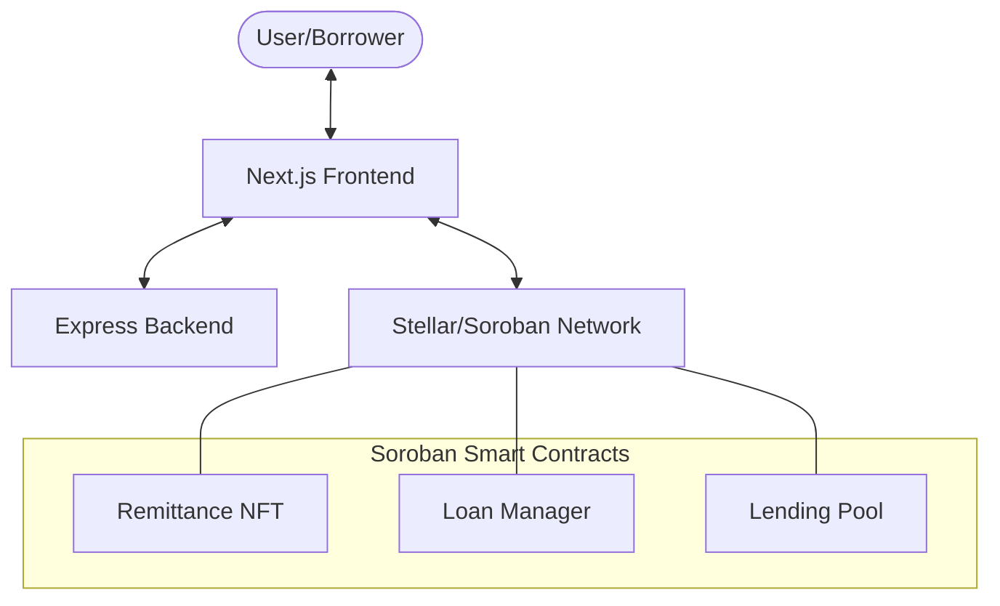

# RemitLend

[](https://opensource.org/licenses/ISC)
[](https://stellar.org)

RemitLend treats remittance history as credit history. Migrant workers prove reliability through monthly transfers, allowing them to receive fair loans without predatory fees. Lenders earn transparent yield on the Stellar testnet.

## 🚀 Vision

Migrant workers often lack traditional credit history in host countries, forcing them towards high-interest payday loans. RemitLend bridges this gap by turning consistent remittance records into an on-chain reliability score, unlocking access to affordable capital.

## ✨ Key Features

- **Credit Scoring via Remittances**: Transform remittance history into verifiable on-chain credit scores
- **NFT-Based Collateral**: Remittance NFTs serve as proof of reliability and loan collateral
- **Decentralized Lending Pools**: Lenders provide liquidity and earn transparent yields
- **Non-Custodial**: Users maintain full control of their funds through Stellar wallets
- **Transparent & Auditable**: All transactions and loan terms recorded on-chain

## 🏗 Project Structure

The repository is organized as a monorepo containing the following components:

- **`backend/`**: Express.js server providing API support and metadata management.
- **`frontend/`**: Next.js web application for borrowers and lenders.
- **`contracts/`**: Soroban (Rust) smart contracts covering loans, pools, and NFTs.

## 🛠 Tech Stack

- **Blockchain**: [Stellar](https://stellar.org) (Soroban)
- **Frontend**: Next.js, TypeScript, Tailwind CSS
- **Backend**: Node.js, Express, TypeScript
- **Wallet**: [Stellar Wallet Kit](https://github.com/stellar/stellar-wallet-kit) (Freighter, etc.)

## 📐 Architecture

The following diagram illustrates the high-level interaction between RemitLend components:



## 🏁 Getting Started

### Prerequisites

- [Node.js](https://nodejs.org/) (v18 or higher)
- [npm](https://www.npmjs.com/) or [yarn](https://yarnpkg.com/)
- [Docker](https://www.docker.com/) (Optional, recommended for easy setup)
- [Rust & Cargo](https://rustup.rs/) (Required for contract development)
- [Soroban CLI](https://soroban.stellar.org/docs/getting-started/setup) (Required for contract deployment)
- [Stellar Wallet](https://www.stellar.org/ecosystem/wallets) (Freighter recommended for testing)

### Quick Start with Docker (Recommended)

1. **Clone the repository:**
   ```bash
   git clone https://github.com/your-repo/remitlend.git
   cd remitlend
   ```

2. **Configure environment:**
   ```bash
   cp backend/.env.example backend/.env
   ```
   Edit `backend/.env` if needed (defaults work for local development).

3. **Start all services:**
   ```bash
   docker compose up --build
   ```

4. **Access the application:**
   - Frontend: [http://localhost:3000](http://localhost:3000)
   - Backend API: [http://localhost:3001](http://localhost:3001)
   - API Documentation: [http://localhost:3001/api-docs](http://localhost:3001/api-docs)

### Manual Setup

#### Backend Setup

1. **Navigate to backend directory:**
   ```bash
   cd backend
   ```

2. **Install dependencies:**
   ```bash
   npm install
   ```

3. **Configure environment:**
   ```bash
   cp .env.example .env
   ```
   Update `.env` with your configuration:
   ```env
   CORS_ALLOWED_ORIGINS=http://localhost:3000
   PORT=3001
   ```

4. **Run development server:**
   ```bash
   npm run dev
   ```

5. **Available scripts:**
   - `npm run dev` - Start development server with hot reload
   - `npm run build` - Build for production
   - `npm start` - Run production build
   - `npm test` - Run test suite
   - `npm run lint` - Check code quality
   - `npm run format` - Format code with Prettier

#### Frontend Setup

1. **Navigate to frontend directory:**
   ```bash
   cd frontend
   ```

2. **Install dependencies:**
   ```bash
   npm install
   ```

3. **Run development server:**
   ```bash
   npm run dev
   ```

4. **Access the application:**
   Open [http://localhost:3000](http://localhost:3000) in your browser

5. **Available scripts:**
   - `npm run dev` - Start development server
   - `npm run build` - Build for production
   - `npm start` - Run production build
   - `npm run lint` - Check code quality

#### Smart Contracts Setup

1. **Install Rust and wasm32 target:**
   ```bash
   rustup target add wasm32-unknown-unknown
   ```

2. **Install Soroban CLI:**
   ```bash
   cargo install --locked soroban-cli
   ```

3. **Navigate to contracts directory:**
   ```bash
   cd contracts
   ```

4. **Build all contracts:**
   ```bash
   cargo build --target wasm32-unknown-unknown --release
   ```

5. **Run tests:**
   ```bash
   cargo test
   ```

6. **Deploy to testnet (example):**
   ```bash
   soroban contract deploy \
     --wasm target/wasm32-unknown-unknown/release/remittance_nft.wasm \
     --source <YOUR_SECRET_KEY> \
     --rpc-url https://soroban-testnet.stellar.org \
     --network-passphrase "Test SDF Network ; September 2015"
   ```

## 🤝 Contributing

We welcome contributions from developers of all skill levels! Please see our [CONTRIBUTING.md](CONTRIBUTING.md) for detailed guidelines on how to get started.

### Quick Contribution Guide

1. Fork the repository
2. Create a feature branch (`git checkout -b feature/amazing-feature`)
3. Make your changes and commit (`git commit -m 'Add amazing feature'`)
4. Push to your branch (`git push origin feature/amazing-feature`)
5. Open a Pull Request

## 📚 Documentation

- [Architecture Overview](ARCHITECTURE.md) - System design and component interactions
- [Contributing Guide](CONTRIBUTING.md) - How to contribute to the project
- [Backend API Docs](http://localhost:3001/api-docs) - Swagger/OpenAPI documentation (when running locally)
- [Soroban Documentation](https://soroban.stellar.org/docs) - Smart contract platform docs

## 🧪 Testing

### Backend Tests
```bash
cd backend
npm test
```

### Contract Tests
```bash
cd contracts
cargo test
```

## 🐛 Troubleshooting

### Common Issues

**Port already in use:**
```bash
# Kill process on port 3000 or 3001
lsof -ti:3000 | xargs kill -9
lsof -ti:3001 | xargs kill -9
```

**Docker build fails:**
```bash
# Clean Docker cache and rebuild
docker compose down -v
docker system prune -a
docker compose up --build
```

**Contract build errors:**
```bash
# Ensure wasm32 target is installed
rustup target add wasm32-unknown-unknown
```

**Wallet connection issues:**
- Ensure you have Freighter or another Stellar wallet installed
- Switch to Stellar Testnet in your wallet settings
- Get testnet XLM from the [Stellar Laboratory](https://laboratory.stellar.org/#account-creator)

## 🗺️ Roadmap

- [ ] Integration with real remittance APIs (Wise, Western Union)
- [ ] Mobile application (React Native)
- [ ] Multi-currency support
- [ ] Automated loan approval based on risk scoring
- [ ] Governance token for protocol decisions
- [ ] Mainnet deployment

## 📄 License

This project is licensed under the ISC License - see the LICENSE file for details.

## 🙏 Acknowledgments

- Built on [Stellar](https://stellar.org) blockchain
- Powered by [Soroban](https://soroban.stellar.org/) smart contracts
- Inspired by the need for financial inclusion for migrant workers worldwide

## 📞 Support

- Open an [issue](https://github.com/your-repo/remitlend/issues) for bug reports or feature requests
- Join our community discussions
- Follow the project for updates

---

Made with ❤️ for migrant workers worldwide
